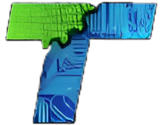

# Technocrats Robotics Website

Welcome to the official website of **Technocrats Robotics**, where a dedicated team of passionate engineering students from **VIT Chennai** comes together to innovate in robotics and automation. Built by **Kaustav Malik**, this platform highlights the collective efforts of our team, showcasing projects, achievements, and milestones as we strive to push the boundaries of technology.

---

## Features
- **About Us**: Learn more about our team’s mission, vision, and journey.
- **Projects**: Explore our cutting-edge robotics projects, including rovers and bots.
- **Achievements**: Discover our milestones in national and international competitions.
- **Team**: Meet the brilliant minds driving our success.
- **Updates**: Stay informed about our latest news, events, and recruitment opportunities.

---

## Team Logo


---

## Tech Stack
- **Frontend**: HTML, CSS, JavaScript
- **Deployment**: GitHub Pages, or similar platforms

---

## Contribution

We welcome contributions to enhance the website! To contribute:
1. Fork this repository.
2. Create a new branch for your feature:
   ```bash
   git checkout -b feature-name
   ```
3. Commit your changes:
   ```bash
   git commit -m "Add feature description"
   ```
4. Push your branch:
   ```bash
   git push origin feature-name
   ```
5. Open a pull request for review.

---

## License

This project is licensed under the [MIT License](LICENSE).

---

## Contact

For feedback, suggestions, or queries, reach out to us:
- **Email**: technocratsrobotics@vit.ac.in
- **WhatsApp Channel**: [Join Here](https://whatsapp.com/channel/0029VajSuNJ8PgsDmbHqwK0J)
- **Instagram**: [Technocrats Robotics](https://www.instagram.com/technocratsrobotics/)

---
